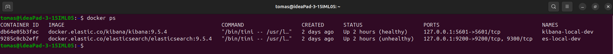
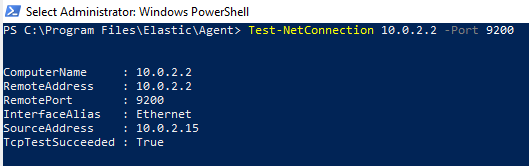
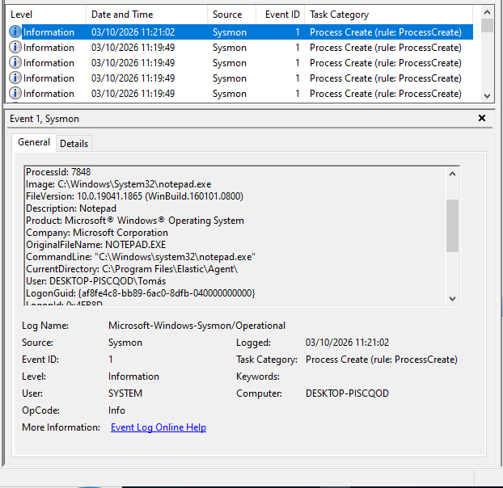
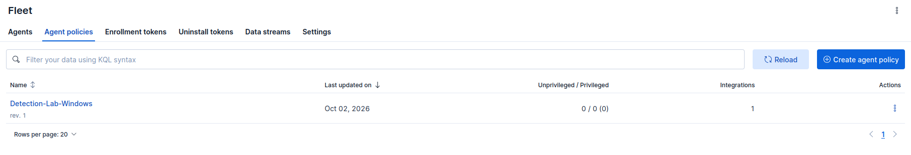
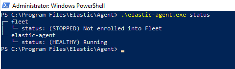
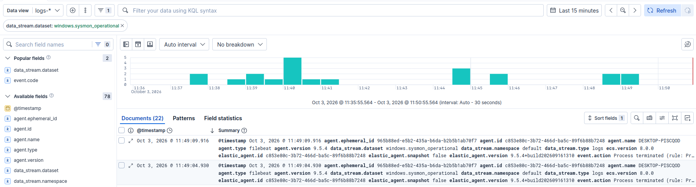
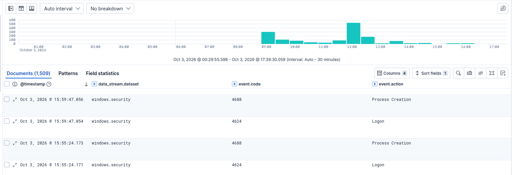
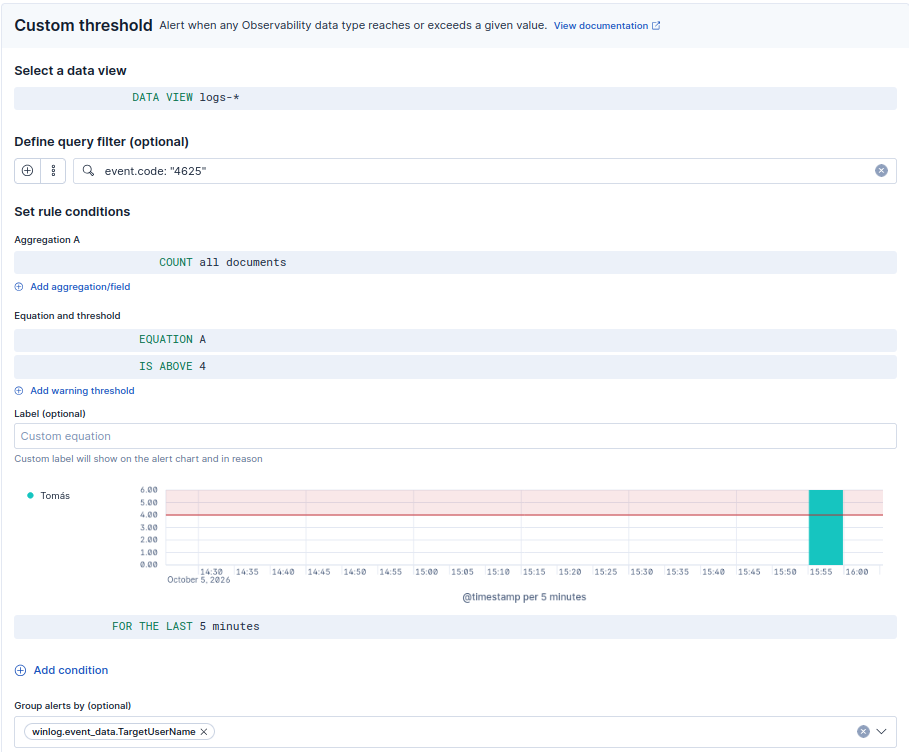

# Detection-Engineering-Lab

A hands-on cybersecurity lab focused on **security telemetry, detection engineering, attack simulation, alert investigation and MITRE ATT&CK mapping** using Windows, Sysmon and Elastic.

---

## Lab Architecture

```text
Windows 10 VM
    │
    ├── Windows Event Logs
    └── Sysmon
            │
            ▼
      Elastic Agent
            │
            ▼
      Elasticsearch
            │
            ▼
         Kibana
            │
            ▼
 Detection & Investigation
```

---

# Lab Setup

## Step 1 — Install Docker

Docker Engine and Docker Compose were installed on the Ubuntu host.

Verify the installation:

```bash
docker --version
docker compose version
```

Verify that Docker is running:

```bash
sudo systemctl status docker
```

---

## Step 2 — Deploy Elasticsearch and Kibana

Elasticsearch and Kibana were deployed on the Ubuntu host using Elastic's local development environment.

```bash
curl -fsSL https://elastic.co/start-local | sh
```

This creates a local Elastic Stack deployment using Docker, including:

* Elasticsearch
* Kibana
* Elasticsearch API endpoint
* Authentication credentials

The deployment was verified by checking the running containers:

```bash
docker ps
```

The main services used by the lab are:

* Elasticsearch: port 9200
* Kibana: port 5601

Kibana is used as the main interface for inspecting and investigating the telemetry collected by the lab.




---

## Step 3 — Configure Windows VM

A Windows 10 virtual machine was created using VirtualBox.

### VM Configuration

* **Operating System:** Windows 10
* **RAM:** 3 GB
* **CPU:** 2 vCPUs
* **Virtual Disk:** 60 GB
* **Network:** NAT

Windows 10 is used exclusively as the endpoint generating security telemetry for the lab.

The Windows VM was assigned the following network configuration:

```
Windows VM
IP: 10.0.2.15
Gateway: 10.0.2.2
```

Because the VM uses VirtualBox NAT, 127.0.0.1 from inside Windows refers to the Windows VM itself and not to the Ubuntu host.

Therefore, the Elastic Agent cannot use:

```
127.0.0.1:9200
```

to communicate with Elasticsearch running on Ubuntu.

The Elasticsearch endpoint used by the Agent was:

```
10.0.2.2:9200
```

Connectivity was verified from Windows:



---

## Step 4 — Configure Windows Security Telemetry

### Windows Event Logs

Windows Event Logs are enabled by default and provide the base telemetry for the lab.

The main log sources used are:

* Security
* System
* Application

---

### Advanced Audit Policy

The following Advanced Audit Policies were configured.

#### Account Logon

**Advanced Audit Policy → Account Logon**

* **Auditar validação de credenciais** → ☑ Success

---

#### Logon/Logoff

**Políticas de Auditoria Avançada → Início de sessão/Fim de sessão**

* **Auditar início de sessão** → ☑ Success + ☑ Failure
* **Auditar encerramento de sessão** → ☑ Success
* **Auditar bloqueio de conta** → ☑ Failure

---

#### Detailed Tracking

**Políticas de Auditoria Avançada → Controlo detalhado**

* **Auditar criação de processos** → ☑ Success

These settings provide additional Windows Security telemetry that will later be collected and analyzed through Elastic.

---

## Step 5 — Install and Configure Sysmon

Microsoft Sysinternals Sysmon was installed to provide detailed endpoint telemetry, particularly process and command-line activity.

### Install Sysmon

After downloading and extracting the Sysmon ZIP:

```cmd
Sysmon64.exe -accepteula -i
```

Sysmon was installed using its default configuration.

### Verify Sysmon Events

Open Event Viewer:

```cmd
eventvwr.msc
```

Navigate to:

**Applications and Services Logs → Microsoft → Windows → Sysmon → Operational**

A test process was executed:

```cmd
notepad.exe
```

The resulting **Sysmon Event ID 1 — Process creation** was verified.

Relevant telemetry fields included:

* `Image`
* `CommandLine`
* `ParentImage`
* `User`
* `Hashes`

At this stage, **Windows Event Logs and Sysmon are generating endpoint telemetry successfully**.

Sysmon Event ID 1 - notepad.exe



---

## Step 6 — Install and Configure Elastic Agent

Elastic Agent was introduced as the collection and forwarding component between the Windows endpoint and Elasticsearch.

The Agent was configured in standalone mode, meaning its configuration is maintained locally rather than being centrally managed by Fleet. Elastic documents standalone agents as locally managed agents using the elastic-agent.yml configuration file.

```text
Windows 10
    │
    ├── Windows Event Logs
    │
    └── Sysmon
          │
          ▼
    Elastic Agent
          │
          ▼
    Elasticsearch
          │
          ▼
       Kibana
```

### Step 6.1 — Create a Standalone Agent Policy in Kibana

Kibana was used to create an initial standalone Agent policy.

In Kibana:

```
Add Integrations
        ↓
Elastic Agent
        ↓
Create Agent Policy
```

A dedicated policy was created - **Detection-Lab-Windows**

The policy was then used as the starting point for the standalone Agent configuration.

This approach is useful because Kibana prepares the required configuration and integration assets instead of requiring the entire policy to be written manually. Elastic specifically recommends using Kibana to create and download a standalone policy to reduce configuration errors.

Important: the Agent was not enrolled into Fleet. The policy was used as a configuration starting point, while the installed Agent runs in standalone mode.

Agent Policy - Detection-Lab-Windows




### Step 6.2 — Select Standalone Mode

Kibana was used to create the initial Elastic Agent policy.

A dedicated policy named `Detection-Lab-Windows` was created.

During the Agent setup, the **Run standalone** option was selected. This provided the standalone policy configuration and installation instructions for the Windows host.

Unlike Fleet-managed Agents, the standalone Agent is configured and managed locally through:

```text
C:\Program Files\Elastic\Agent\elastic-agent.yml
```

The Agent was therefore not enrolled into Fleet. Configuration changes were made directly to the local policy file.


### Step 6.3 — Configure Elasticsearch Output


The standalone Agent configuration was stored on Windows at:

```
C:\Program Files\Elastic\Agent\elastic-agent.yml
```

The Elasticsearch output was configured to use the Ubuntu Elasticsearch instance:

```
outputs:
  default:
    type: elasticsearch
    hosts:
      - 10.0.2.2:9200
    api_key: "ID:API_KEY"
    preset: balanced
```

A dedicated API key was created for the Agent with permissions required to monitor Elasticsearch and ingest telemetry.

The API key was then configured in the Agent output.


### Step 6.4 — Install Elastic Agent on Windows

The Elastic Agent package was extracted on the Windows VM.

From an elevated PowerShell session, the Agent was installed using:

```
.\elastic-agent.exe install
```

The Agent was installed as a Windows service.

The installed configuration is located at:

```
C:\Program Files\Elastic\Agent\elastic-agent.yml
```

### Step 6.5 — Verify Elastic Agent

The Agent configuration was inspected using:

```
.\elastic-agent.exe inspect
```

This was used to verify:

* Elasticsearch endpoint
* Elasticsearch output
* API key configuration
* Configured inputs

The Agent status was then checked:




### Step 6.6 — Configure Windows System Metrics 

The standalone configuration initially included the system/metrics input:

```
- type: system/metrics
  id: unique-system-metrics-input
  data_stream.namespace: default
  use_output: default
  streams:
    - metricsets:
      - cpu
      data_stream.dataset: system.cpu

    - metricsets:
      - memory
      data_stream.dataset: system.memory

    - metricsets:
      - network
      data_stream.dataset: system.network

    - metricsets:
      - filesystem
      data_stream.dataset: system.filesystem
```

This allowed the Agent to collect basic host metrics and also provided an initial way to verify that the Agent could successfully authenticate and send data to Elasticsearch.

The resulting metrics were observed in Kibana, confirming that the Agent-to-Elasticsearch pipeline was functioning.


### Step 6.7 — Configure Sysmon Collection

After confirming that the Agent was healthy and communicating with Elasticsearch, a winlog input was added to collect the Sysmon Windows Event Log channel.

Sysmon writes its events to:

```
Microsoft-Windows-Sysmon/Operational
```

The Agent configuration was:

```
- type: winlog
  id: sysmon
  use_output: default
  streams:
    - name: Microsoft-Windows-Sysmon/Operational
      data_stream:
        dataset: windows.sysmon_operational
        type: logs
```

The winlog input reads Windows Event Logs through the Windows Event Log API and forwards the events to the configured output - https://www.elastic.co/docs/reference/fleet/elastic-agent-inputs-list

After applying this configuration I validated the agent status to check if it's still "Healthy"

**Verify Sysmon Ingestion**:

Once the Sysmon input was enabled, Sysmon events started appearing in Elasticsearch/Kibana.

Kibana Discover showing **windows.sysmon_operational** events:




### Step 6.8 — Configure Windows Security Event Collection

After confirming that Sysmon events were being successfully ingested, the standalone Agent configuration was extended to collect the Windows **Security** Event Log.

The Windows Security log contains authentication, account, process, and other security-related events that are important for detection engineering.

The Agent configuration was:

```yaml
- type: winlog
  id: security
  use_output: default
  streams:
    - name: Security
      data_stream:
        dataset: windows.security
        type: logs
```

The `winlog` input reads events from the Windows Event Log and forwards them to the configured Elasticsearch output.

After applying the configuration, the Agent status was checked again to confirm that it remained **Healthy**.

**Verify Windows Security Ingestion:**

Once the Security input and audit policies were configured, Windows Security events started appearing in Elasticsearch/Kibana.

Kibana Discover showing **windows.security** events:




## Step 7 — Detection Engineering

Detections are developed through a repeatable detection engineering workflow.

Each detection is implemented, simulated, validated, investigated, tuned, mapped to MITRE ATT&CK, and documented in a dedicated detection playbook.

### Detection Workflow

```text
Define Behavior
      ↓
Identify Telemetry
      ↓
Implement Detection
      ↓
Attack Simulation
      ↓
Detection Validation
      ↓
Alert Investigation
      ↓
MITRE ATT&CK Mapping
      ↓
Tuning
      ↓
Documentation
```

### Implemented Detections

| Detection              | Data Source      | Event ID | MITRE ATT&CK        | Status    |
| ---------------------- | ---------------- | -------: | ------------------- | --------- |
| Multiple Failed Logons | Windows Security |     4625 | T1110 — Brute Force | Validated |
| PowerShell Execution Policy Bypass | Windows Security | 1 | T1110 — Brute Force | Validated |

Detailed detection logic, simulation procedures, investigation steps, false-positive considerations, tuning, and response guidance are maintained in individual **Detection Playbooks** under [`docs/detections/`](docs/detections/).


### Example Detection — Multiple Failed Logons

The **Multiple Failed Logons** detection is used as the first example of the complete detection engineering workflow.

The detection uses Windows Security Event ID `4625`, generated when a Windows logon attempt fails.

The detection uses the following KQL query and threshold configuration:



Therefore, the rule generates an alert when **5 or more failed logon events** are observed within a five-minute window on a single account.

The detection is mapped to **MITRE ATT&CK T1110 — Brute Force**, as repeated failed authentication attempts may indicate brute-force activity. The detection itself does not confirm that a brute-force attack occurred.

The complete implementation and investigation details are documented in the corresponding [Detection Playbook](docs/detections/windows-multiple-failed-logons.md).

---

## Step 8 — Attack Simulation

Controlled simulations are performed to generate telemetry representing different adversary behaviors.

Planned simulation categories include:

* Failed authentication
* Suspicious PowerShell
* Process execution
* Persistence
* Network activity
* Other controlled adversary behaviors

Each simulation is associated with one or more detection playbooks and is performed in the isolated Windows laboratory environment.

The first completed simulation involved repeated failed authentication attempts against the Windows 10 lab machine, generating Event ID `4625` telemetry.

---

## Step 9 — Detection Validation

Each detection is validated by following the complete telemetry-to-alert pipeline:

```text
Attack
  ↓
Telemetry
  ↓
Detection
  ↓
Alert
  ↓
Investigation
  ↓
Response
```

As an example, the **Multiple Failed Logons** detection was validated by generating five failed authentication attempts.


This confirmed that the simulated behavior generated the expected Windows telemetry and successfully triggered the detection.

The screenshot above is provided as an **example of the validation process**. Detailed evidence and investigation results for each detection are maintained in their respective playbooks.

---

## Step 10 — Investigation & Response

Generated alerts are investigated in Kibana to determine the context and potential significance of the detected behavior.

Investigation activities may include:

* Reviewing the underlying telemetry
* Identifying the affected host
* Identifying the targeted account
* Identifying the reported source
* Correlating related events
* Checking for successful authentication following failed attempts
* Identifying activity against other accounts
* Determining whether the behavior is expected or suspicious

Potential response actions, depending on the investigation results and organizational procedures, may include:

* Blocking or containing the source
* Disabling or locking an affected account
* Resetting credentials
* Investigating the originating host
* Escalating the incident for further investigation

Detailed investigation and response procedures are documented within each detection playbook.

The following screenshot shows the Windows Security events ingested into Elastic and the fields used during the investigation.


---

## Step 11 — Documentation

Each detection is documented in a dedicated **Detection Playbook**.

The playbooks provide a consistent structure for documenting:

* Detection objective
* Data source
* Event IDs
* Detection logic
* MITRE ATT&CK mapping
* Attack simulation
* Expected telemetry
* Detection validation
* Investigation procedure
* False-positive considerations
* Tuning
* Response actions
* Evidence

This README provides an overview of the detection engineering process and implemented detections, while the individual playbooks contain the detailed technical documentation for each detection.

The first playbook is:

**[Windows — Multiple Failed Logons](docs/detections/windows-multiple-failed-logons.md)**

