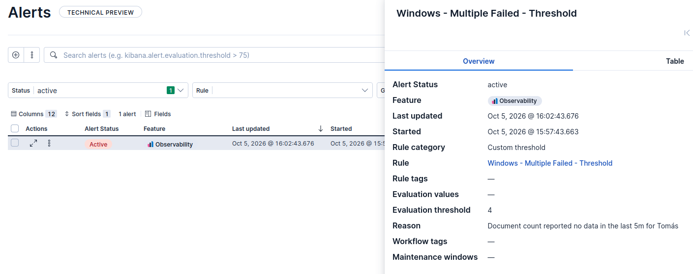
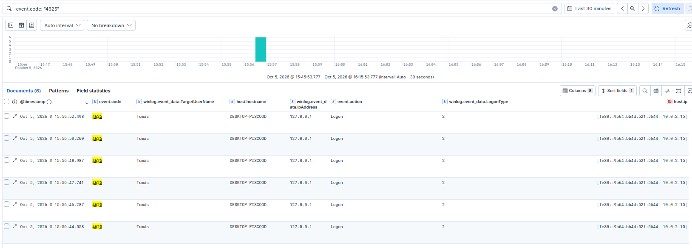

# Windows — Multiple Failed Logons

## 1. Objective

Detect repeated failed authentication attempts on a Windows endpoint that may indicate brute-force or password-guessing activity.

The detection is based on Windows Security **Event ID 4625**, generated when a logon attempt fails.

---

## 2. Rule Configuration and Detection Logic

The detection uses the Windows **Security** Event Log collected by Elastic Agent.

The detection was implemented in Kibana using a **Custom threshold** rule.

### KQL

```kql
event.code: "4625"
```

### Rule Configuration

| Setting        | Value                              |
| -------------- | ---------------------------------- |
| Data view      | `logs-*`                           |
| Query          | `event.code: "4625"`               |
| Condition      | Count above 4                      |
| Time window    | 5 minutes                          |
| Group alerts   | `winlog.event_data.TargetUserName` |
| Check interval | 1 minute                           |
| Rule name      | `Windows - Multiple Failed`        |

The rule generates an alert when **5 or more Event ID 4625 events** are observed for the same account within a 5-minute window.

The threshold is configured as **above 4**, meaning that 5 events are required to trigger the alert.

---

## 3. MITRE ATT&CK Mapping

### T1110 — Brute Force

The detection is mapped to **MITRE ATT&CK T1110 — Brute Force**.

Repeated failed authentication attempts can indicate password guessing or brute-force activity.

However, the detection does **not** confirm that a brute-force attack occurred. Legitimate scenarios, such as repeated incorrect passwords or applications using outdated credentials, can also generate multiple 4625 events.

The MITRE mapping therefore represents the **behavior being detected**, rather than confirmed malicious activity.

---

## 4. Attack Simulation and Detection Validation

Five incorrect authentication attempts were performed within a five-minute period, generating multiple Windows Security Event ID 4625 events.

The generated 4625 events were successfully ingested into Elasticsearch and detected by the Kibana rule. The rule generated an alert confirming that the threshold condition was met.




This validated the complete detection pipeline:

1. Windows generated Event ID 4625.
2. Elastic Agent collected the event.
3. The event was indexed into Elasticsearch.
4. The Kibana rule identified the event.
5. The threshold condition was met.
6. An alert was generated.

---

## 5. Investigation

The individual 4625 events should be investigated to determine whether the activity is expected or suspicious.

Relevant fields include:

| Field                               | Purpose                                        |
| ----------------------------------- | ---------------------------------------------- |
| `event.code`                        | Windows event identifier                       |
| `host.name`                         | Windows endpoint                               |
| `host.ip`                           | IP address associated with the endpoint        |
| `winlog.event_data.TargetUserName`  | Account involved in the authentication attempt |
| `winlog.event_data.IpAddress`       | Source address reported by Windows             |
| `winlog.event_data.LogonType`       | Type of logon attempt                          |
| `winlog.event_data.WorkstationName` | Workstation associated with the event          |

### Example Investigation

For the lab-generated events:

```text
event.code: 4625
winlog.event_data.TargetUserName: Tomás
winlog.event_data.IpAddress: 127.0.0.1
winlog.event_data.LogonType: 2
```

Windows reported `127.0.0.1` as the source address, indicating that the test was associated with a local authentication attempt.

`LogonType 2` corresponds to an **interactive logon**, which is consistent with the manual authentication test performed during the simulation.

This demonstrates why an alert should not immediately be considered a confirmed brute-force attack. The surrounding event context must be investigated before determining whether the activity is malicious.

The following screenshot shows the Windows Security events ingested into Elastic and the fields used during the investigation.



---

## 6. False Positives

Multiple failed logons can occur for legitimate reasons, including:

* Users repeatedly entering an incorrect password
* Forgotten or recently changed passwords
* Applications using outdated credentials
* Scheduled tasks or services using invalid credentials
* Administrative troubleshooting

The detection should therefore be treated as a **suspicious authentication signal**, rather than a confirmed attack.

---

## 7. Response Considerations

If triggered in a production environment, the alert should be investigated before taking containment actions.

The investigation should include:

1. Identify the affected account.
2. Identify the reported source IP or workstation.
3. Review the logon type and surrounding events.
4. Check for successful authentication following the failed attempts.
5. Determine whether the activity is expected or suspicious.
6. Investigate additional endpoint or network activity if required.

---

## 8. Limitations

* The rule does not currently correlate failed and successful authentication events.
* Legitimate activity can generate multiple failed logons.
* The threshold has not been tuned for a production environment.
* The detection was validated in a controlled Windows 10 lab environment.

---

## 11. Status

**Status:** Validated

The detection was successfully tested end-to-end:

```text
Windows failed authentication
        ↓
Event ID 4625
        ↓
Elastic Agent
        ↓
Elasticsearch
        ↓
Kibana Detection Rule
        ↓
5 events within 5 minutes
        ↓
Alert
```

